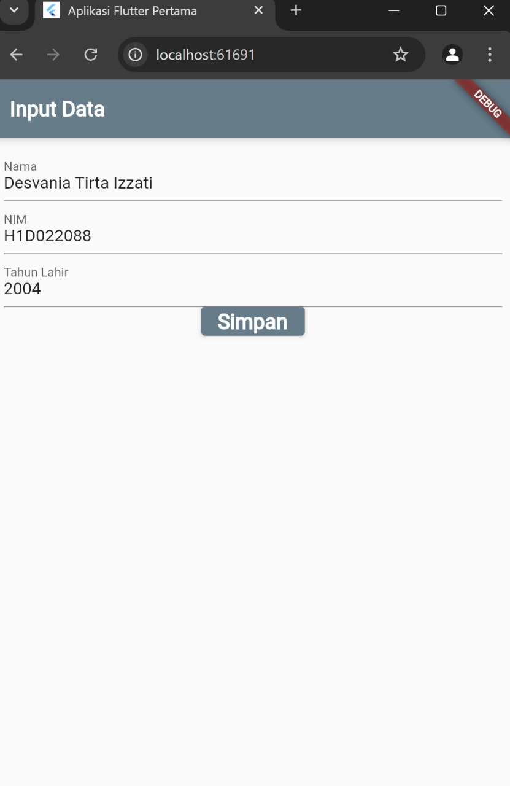
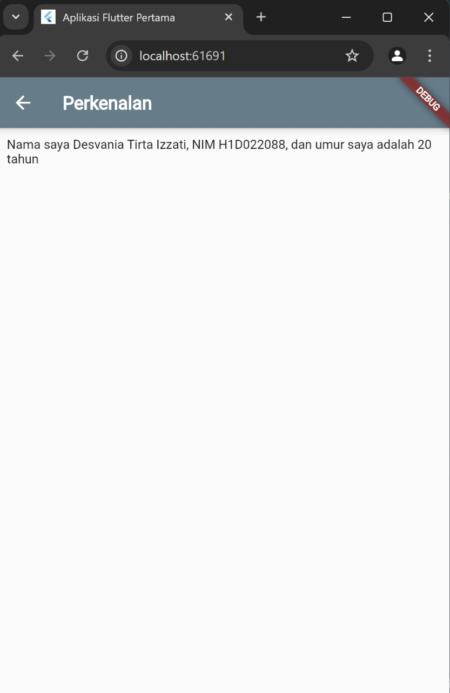

# Tugas Pertemuan 2

JELASKAN PROSES PASSING DATA DARI FORM MENUJU TAMPILAN DENGAN FILE `README.md`

1. data yang dimasukkan di form dikumpulkan dengan menggunakan TextEditingController seperti di bawah ini

class FormDataState extends State<FormData> {
  final _namaController = TextEditingController();
  final _nimController = TextEditingController();
  final _tahunController = TextEditingController();

2. ketika pengguna menekan tombol submit, maka datanya akan diproses sesuai dengan fungsi yang terhubung dengan tombol melalui onPressed(),

3. kemudian tampilan akan berpindah ke halaman baru melalu function navigator di bawah ini

 Navigator.of(context).push(MaterialPageRoute(
              builder: (context) =>
                  TampilData(nama: nama, nim: nim, tahun: tahun))

4. lalu data diterima di halaman selanjutnya yaitu tampil_data melalui constructornya

class TampilData extends StatelessWidget {
  final String nama;
  final String nim;
  final int tahun;

  const TampilData({
    Key? key,
    required this.nama,
    required this.nim,
    required this.tahun,
  }) : super(key: key);

5. kemudian data yang diterima diolah berdasarkan method untuk menampilakn datanya

Widget build(BuildContext context) {
    final int umur = DateTime.now().year - tahun;
    return Scaffold(
      appBar: AppBar(
        title: const Text("Perkenalan"),
        backgroundColor: Colors.blueGrey,
        titleTextStyle: const TextStyle(
          fontFamily: 'Open Sans',
          color: Colors.white,
          fontSize: 20,
          fontWeight: FontWeight.bold,
        ),
      ),
      body: Container(
        margin: const EdgeInsets.all(10),
        child: Column(
          children: [
            Text("Nama saya $nama, NIM $nim, dan umur saya adalah $umur tahun"),
          ],
        ),
      ),
    );
  }

Nama : Desvania Tirta Izzati

NIM : H1D022088

Shift Baru: D

## Screenshot
Contoh :

